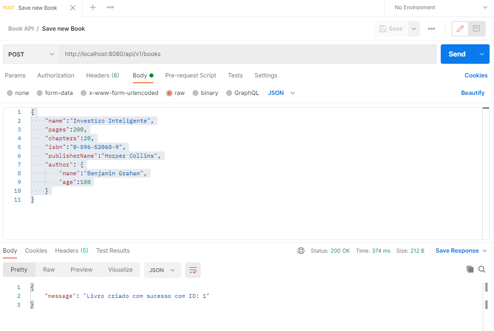
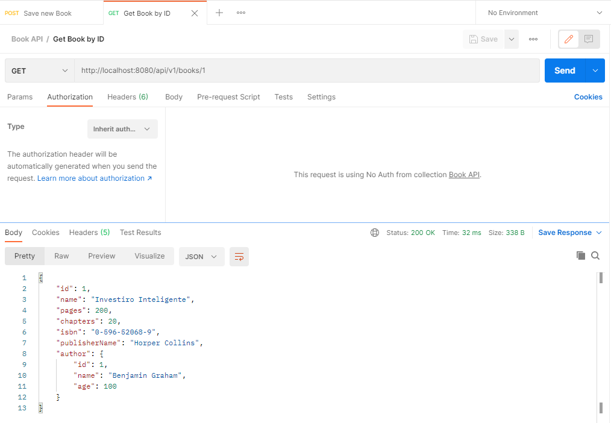

<h2>BookStore Manager API</h2>
<hr>
O objetivo do BookStore Manager API é disponibilizar uma API para cadastro e consulta de livros por ID de uma livraria através de uma API REST.
<br>
<br>
Projeto desenvolvido em SpringBoot,JAVA,Lombok com utilização de Testes Unitários para cobertura de testes.
<br>
<br>
Para executar o projeto no terminal , digite o seguinte comando:
<br>

```
mvn spring-boot:run 
```

Para testar a API é interessante utilizar o POSTMAN ou INSONMIA 
passando uma requisição JSON com os seguintes atributos,conforme o exemplo
utilizando um método POST conforme o exemplo abaixo:

```
    {
        "name":"Nome do livro",
        "pages":200,
        "chapters":20,
        "isbn":"0-596-52068-9",
        "publisherName":"Nome do Publicador",
        "author": {
            "name":"Nome do Autor do Livro",
            "age":100
        }
    }
```
Passando esses valores para o endereço da API no Postman:
``http://localhost:8080/api/v1/books``

Conforme o exemplo da imagem:
<br>



Após o cadastro do Livro na API Rest, é possível consultar o ID do livro 
através do Método GET no Postman através do endereço :
``http://localhost:8080/api/v1/books/1``



Para este projeto são necessários os seguintes pré-requisitos para a execução
do projeto :
- Conhecimento básico de JAVA e SpringBoot.
- Java 8 ou versões superiores.
- Maven 3.6.3 ou versões superiores.
- Intellij IDEA Comunity Edition ou IDE favorita.
- Controle de versão GIT instalado em sua máquina.
- Conta no Github para armazenamento do seu projeto na nuvem.
- Conta no Heroku para o deploy de projeto na nuvem.


<h2>
<g-emoji class="g-emoji" alias="postbox" fallback-src="https://github.githubassets.com/images/icons/emoji/unicode/1f4ee.png">📮</g-emoji>Contato</h2>
<hr>
<p>Email : <a href="mailto:tiago.programador@hotmail.com">
tiago.programador@hotmail.com</a> </p>
<p>Site Portifólio : <a href="http://www.tiagoribeirosantos.6te.net"> http://www.tiagoribeirosantos.6te.net</a></p>
<p>LinkEdin: <a href="https://www.linkedin.com/in/tiago-ribeiro-santos-93925862">https://www.linkedin.com/in/tiago-ribeiro-santos-93925862</a></p>

